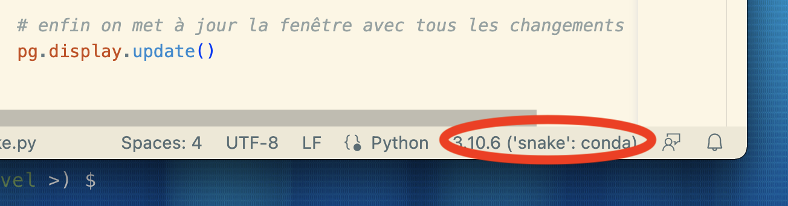
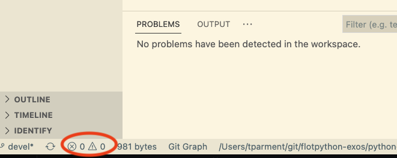

# Agar.io

Le but de ce TP est de réaliser un petit jeu en Python basé sur le jeu : https://agar.io.

L'objectif est de vous apprendre à concevoir et réaliser un programme complet, et non de réaliser le nouveau best-seller.

Gardez ainsi en tête que votre objectif est de réaliser un **programme qui marche** et pas un programme parfait.

## Prérequis

_Ce qui suit suppose que vous avez installé Python avec `conda` et que vous avez un terminal `bash` fonctionnel sur votre ordinateur._

Commencez par créer et activer un environnement dédié au TP:

```bash
# on commence par créer un environnement "agario"
(base) $ conda create -n agario python=3.9
# puis on l'active
(base) $ conda activate agario
# votre terminal doit indiquer le nom d'environnement:
(agario) $
```

**NOTE** Si vous ne voyez pas, comme montré ici, le `(agario)` affiché dans le prompt de bash pour vous rappeler en permanence dans quel environnement on se trouve, il vous faut taper ceci avant de relancer un terminal

```bash
$ conda init bash
```

Installez ensuite la dernière version du module `pygame` avec `pip`:

```bash
(agario) $ pip install pygame
```

Pour tester votre installation, vous pouvez lancer le programme d'exemple comme suit:

```bash
(agario) $ python -m pygame.examples.aliens
```

soyez patient lors du premier lancement, la librairie initialise des tas de choses...

## Code de démarrage

Un premier code très simple est le suivant, écrivez-le dans un fichier `agario.py` et lancez-le avec la commande `python` :

**ATTENTION** je vous recommande de **ne pas essayer d'exécuter ce code depuis un notebook** :

* ni depuis nbhosting, ça ne marchera pas du tout, car `pygame` n'y est pas installé;
* ni depuis votre ordinateur personnel, car vous allez rencontrer des problèmes mystérieux de kernel qui meurt, si vous essayez.

```python
# v0 : on repeint l'écran à une période de 1 seconde

#!/usr/bin/env python
import pygame as pg
from random import randint


def main():
    clock = pg.time.Clock()

    # on initialise pygame et on crée une fenêtre de 640x640 pixels
    pg.init()
    screen = pg.display.set_mode((640, 640))

    # On donne un titre à la fenetre
    pg.display.set_caption("agario")

    # La boucle du jeu
    done = False
    while not done:
        clock.tick(1)

        # on génère une couleur (Rouge, Vert, Bleu) au hasard
        random_color = (randint(0, 255), randint(0, 255), randint(0, 255))
        screen.fill(random_color)

        # enfin on met à jour la fenêtre avec tous les changements
        pg.display.update()

        # on itère sur tous les évênements qui ont eu lieu depuis le précédent appel
        # ici donc tous les évènements survenus durant la seconde précédente
        for event in pg.event.get():
          continue

    pg.quit()


# if python says run, then we should run
if __name__ == "__main__":
    main()
```

Vous pouvez désormais exécuter le programme avec:

```sh
%%sh
(agario) $ python agario.py
```

## Astuces vs-code

**Astuce #1** : il est **fortement recommandé** d'installer l'extension de
vs-code pour Python

**Astuce #2** : on a créé un environnement virtuel;
du coup il est opportun d'indiquer à vs-code qu'il faut utiliser `snake` -
plutôt que `base`
pour cela cliquer dans la bannière du bas la zone qui indique le Python courant



**Astuce #3** : une fois que c'est fait, pour lancer le programme directement
depuis vs-code :

- ouvrir la palette
  * `⇧ ⌘ P` Shift-Command-P (mac)
  * `⇧ ⌃ P` Shift-Control-P (windows)
- chercher la fonction *Python: Create Terminal*
  - mémoriser le raccourci clavier
  - qui est Control-backtick sur Mac (le backtick c'est `)

**Astuce #4** : si vous voulez avoir en permanence une indication
sur la qualité de votre code, regardez la zone en bas à gauche



## Un petit détail

Il faut savoir que c'est l'appel à `pg.display.update()` qui produit réellement l'affichage.

En fait, tous les autres calculs se produisent en mémoire (c'est très rapide), mais à un moment il faut bien parler à la carte vidéo pour l'affichage, et ça c'est beaucoup plus lent (+ieurs centaines de fois plus lent).

Du coup même si ce `display` reste dans l'ordre de grandeur de la milliseconde, il faut s'efforcer, pour une bonne fluidité du jeu, de n'appeler `update()` que le minimum, pour nous ici **une fois par itération de la boucle**.

## On écoute ce qu'il se passe

Le snippet :
```python
        # ...
        # on itère sur tous les évênements qui ont eu lieu depuis le précédent appel
        # ici donc tous les évènements survenus durant la seconde précédente
        for event in pg.event.get():
          continue
        # ...
```
est là pour indiquer que nous écoutons ce qu'il se passe. Il est grand temps de lui indiquer des évènements de jeu à écouter.

## Continuons

Afin d'avoir un comportement plus "normal", nous devons instruire Pygame en lui disant comment réagir aux clicks sur le clavier ou sur la fenêtre:


```python
# v1 : pareil mais au moins on peut sortir du programme
# avec la touche 'q', ou avec la souris en fermant la fenêtre


#!/usr/bin/env python
import pygame as pg
from random import randint


def main():
    clock = pg.time.Clock()

    # on initialise pygame et on crée une fenêtre de 640x640 pixels
    pg.init()
    screen = pg.display.set_mode((640, 640))

    # On donne un titre à la fenetre
    pg.display.set_caption("agario")

    # La boucle du jeu
    done = False
    while not done:
        clock.tick(1)

        # on génère une couleur (Rouge, Vert, Bleu) au hasard
        random_color = (randint(0, 255), randint(0, 255), randint(0, 255))
        screen.fill(random_color)

        # enfin on met à jour la fenêtre avec tous les changements
        pg.display.update()

        # on itère sur tous les évênements qui ont eu lieu depuis le précédent appel
        # ici donc tous les évènements survenus durant la seconde précédente
        for event in pg.event.get():
            # chaque évênement à un type qui décrit la nature de l'évênement
            # un type de pg.QUIT signifie que l'on a cliqué sur la "croix" de la fenêtre
            if event.type == pg.QUIT:
                done = True
            # un type de pg.KEYDOWN signifie que l'on a appuyé une touche du clavier
            elif event.type == pg.KEYDOWN:
                # si la touche est "Q" on veut quitter le programme
                if event.key == pg.K_q:
                    done = True

    pg.quit()


# if python says run, then we should run
if __name__ == "__main__":
    main()
```
